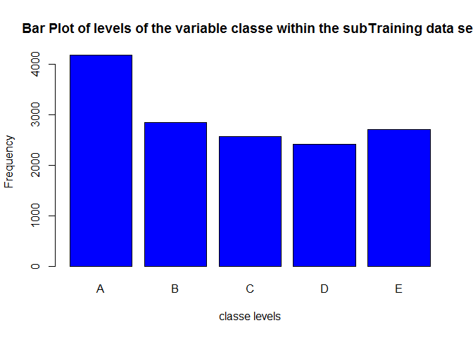
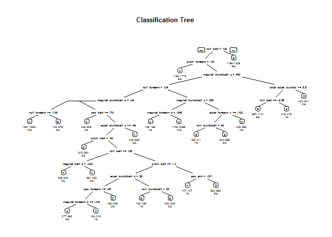

# Practical Machine Learning
svsubbarao  
25 October 2015  
# Practical Machine Learning - Course Project

## Indroduction

For this project, we are given data from accelerometers on the belt, forearm, arm, and dumbell of 6 research study participants. Our training data consists of accelerometer data and a label identifying the quality of the activity the participant was doing. Our testing data consists of accelerometer data without the identifying label. Our goal is to predict the labels for the test set observations.

Below is the code I used when creating the model, estimating the out-of-sample error, and making predictions. I also include a description of each step of the process.

## Loading Training and Test Data

Load caret library and read Training and Testing data .


```r
library(caret)
library(rpart)
library(rpart.plot)
library(randomForest)
trainingData <- read.csv("pml-training.csv",na.strings=c("NA","#DIV/0!",""))
predictData <- read.csv("pml-testing.csv",na.strings=c("NA","#DIV/0!",""))
```

Exploratory Data Analysis reveals that the first 7 fields of the data are dimensional, and may not be pertinent to the prediction model. The balance of the fields are numeric according to the data documentation available here. The balance of the columns are looped through and cast into numeric data with the exception of the last column, which is the categorical class the prediction model will classify for.


```r
for(i in c(8:ncol(trainingData)-1)) {
  trainingData[,i] = as.numeric(as.character(trainingData[,i]))
  predictData[,i] = as.numeric(as.character(predictData[,i]))
}
```

Analysis additionally reveals that of the many variables, several are extraordinarily sparse and thus may not be as useful for building a classification model. The following code initiates a slicer index of column names, removes the columns with null values, and also removes the inital seven columns of dimensional data. Rather than modify the actual data, this vector of column names will be used as a slicer index into the training data, cross-validation data, and the testing data when interacting with a model.


```r
reqCols <- colnames(trainingData)
reqCols <- colnames(trainingData[colSums(is.na(trainingData)) == 0])
reqCols <- reqCols[-c(1:7)]
```

## Splitting Data into Testing and Cross-Validation

To find an optimal model, with the best performance both in Accuracy as well as minimizing Out of Sample Error, the full testing data is split randomly with a set seed with 80% of the data into the training sample and 20% of the data used as cross-validation. When the samples are created, they are sliced by column against the feature set so only the variables of interest are fed into the final model.


```r
set.seed(1300)
subSamples <- createDataPartition(y=trainingData$classe, p=0.75, list=FALSE)
subTraining <- trainingData[subSamples,reqCols]
subTesting <- trainingData[-subSamples,reqCols]
dim(subTraining); dim(subTesting)
```

```
## [1] 14718    53
```

```
## [1] 4904   53
```

The variable "classe" contains 5 levels: A, B, C, D and E. A plot of the outcome variable will allow us to see the frequency of each levels in the subTraining data set and compare one another.


```r
plot(subTraining$classe, col="blue", main="Bar Plot of levels of the variable classe within the subTraining data set", xlab="classe levels", ylab="Frequency")
```

 

From the graph above, we can see that each level frequency is within the same order of magnitude of each other. Level A is the most frequent with more than 4000 occurrences while level D is the least frequent with about 2500 occurrences.

## First prediction model: Using Decision Tree


```r
model1 <- rpart(classe ~ ., data=subTraining, method="class")

# Predicting:
prediction1 <- predict(model1, subTesting, type = "class")

# Plot of the Decision Tree
rpart.plot(model1, main="Classification Tree", extra=102, under=TRUE, faclen=0)
```

 

## Second prediction model: Using Random Forest


```r
model2 <- randomForest(classe ~. , data=subTraining, method="class")

# Predicting:
prediction2 <- predict(model2, subTesting, type = "class")

# Test results on subTesting data set:
confusionMatrix(prediction2, subTesting$classe)
```

```
## Confusion Matrix and Statistics
## 
##           Reference
## Prediction    A    B    C    D    E
##          A 1395    2    0    0    0
##          B    0  947    6    0    0
##          C    0    0  848    7    0
##          D    0    0    1  793    0
##          E    0    0    0    4  901
## 
## Overall Statistics
##                                           
##                Accuracy : 0.9959          
##                  95% CI : (0.9937, 0.9975)
##     No Information Rate : 0.2845          
##     P-Value [Acc > NIR] : < 2.2e-16       
##                                           
##                   Kappa : 0.9948          
##  Mcnemar's Test P-Value : NA              
## 
## Statistics by Class:
## 
##                      Class: A Class: B Class: C Class: D Class: E
## Sensitivity            1.0000   0.9979   0.9918   0.9863   1.0000
## Specificity            0.9994   0.9985   0.9983   0.9998   0.9990
## Pos Pred Value         0.9986   0.9937   0.9918   0.9987   0.9956
## Neg Pred Value         1.0000   0.9995   0.9983   0.9973   1.0000
## Prevalence             0.2845   0.1935   0.1743   0.1639   0.1837
## Detection Rate         0.2845   0.1931   0.1729   0.1617   0.1837
## Detection Prevalence   0.2849   0.1943   0.1743   0.1619   0.1845
## Balanced Accuracy      0.9997   0.9982   0.9950   0.9930   0.9995
```

## Decision

As expected, Random Forest algorithm performed better than Decision Trees.
Accuracy for Random Forest model was 0.995 (95% CI: (0.993, 0.997)) compared to 0.739 (95% CI: (0.727, 0.752)) for Decision Tree model. The random Forest model is choosen. The accuracy of the model is 0.995. The expected out-of-sample error is estimated at 0.005, or 0.5%. The expected out-of-sample error is calculated as 1 - accuracy for predictions made against the cross-validation set. Our Test data set comprises 20 cases. With an accuracy above 99% on our cross-validation data, we can expect that very few, or none, of the test samples will be missclassified.

## Submission


```r
predictfinal <- predict(model2, predictData, type="class")
predictfinal
```

```
##  1  2  3  4  5  6  7  8  9 10 11 12 13 14 15 16 17 18 19 20 
##  B  A  B  A  A  E  D  B  A  A  B  C  B  A  E  E  A  B  B  B 
## Levels: A B C D E
```

```r
pml_write_files = function(x){
  n = length(x)
  for(i in 1:n){
    filename = paste0("problem_id_",i,".txt")
    write.table(x[i],file=filename,quote=FALSE,row.names=FALSE,col.names=FALSE)
  }
}

pml_write_files(predictfinal)
```
